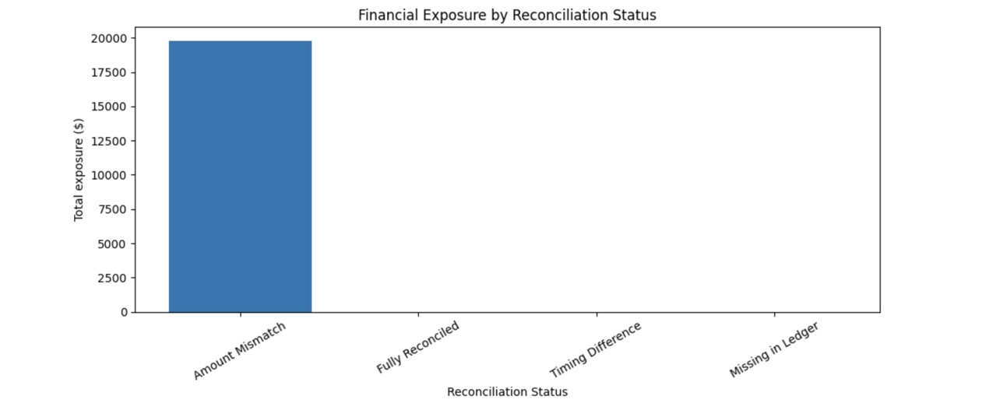
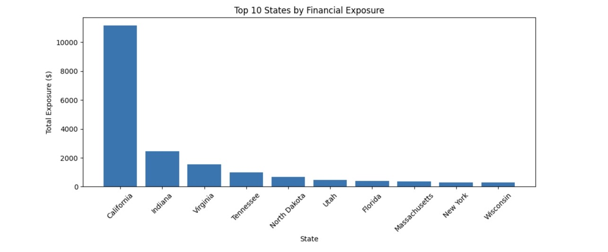

# Finance_Reconciliation & Control Monitoring Analytics

## Overview
This project simulates a financial control environment where transaction-level sales data is reconciled against ledger records to identify discrepancies, quantify unreconciled exposure, and assess concentration risk. The system is designed to mirror internal finance and audit analytics used to monitor reconciliation health, detect risk drivers, and support data-driven control decisions.

## Business Problem
Financial reconciliation processes are critical for ensuring data integrity, revenue accuracy, and audit readiness. Manual reconciliation or limited KPI visibility can obscure financial exposure and delay corrective action.

This project addresses:
- Detection of reconciliation failures
- Classification of discrepency types
- Quantification of financial exposure
- Identification of concentration risk across high-impact transactions

## System Design
The reconciliation pipeline performs the following steps:
1. Standardizes transactional and ledger data
2. Computes transaction-to-ledger variable
3. Applies the tolerance threshold to determine match status
4. Classifies reconciliation outcomes
5. Engineers' KPIs for control monitoring
6. Aggregates exposure and risk metrics
7. Visualizes reconciliation health and concentration drivers

## Key Metrics & Results
- **Reconciliation Rate:** 63.37%
- **Unreconciled Rate:** 36.63%
- **Total Unreconciled Exposure:** $19,795.56
- **Exposure as % of Revenue:** 1.03%
- **Top 10 Transactions Drive:** 91.68% of unreconciled exposure

These results highlight a high concentration of risk within a small subset of transactions, a key insight for prioritizing remediation efforts.

## Risk Concentration Analysis
The system identifies high-risk orders by ranking absolute reconciliation variances and quantifying exposure concentration to support targeted investigation and control design.

## Visual Outputs
### Financial Exposure by Reconciliation Status

### Top 10 States by Financial Exposure

## Tech Stack
- Python
- Pandas
- Numpy
- Matplotlib
- Jupyter Notebook

## Notes
This project is presented as a portfolio artifact focused on analytics system design, KPI engineering, and risk analysis. Code structure and outputs are intentionally curated for clarity and professional presentation.
